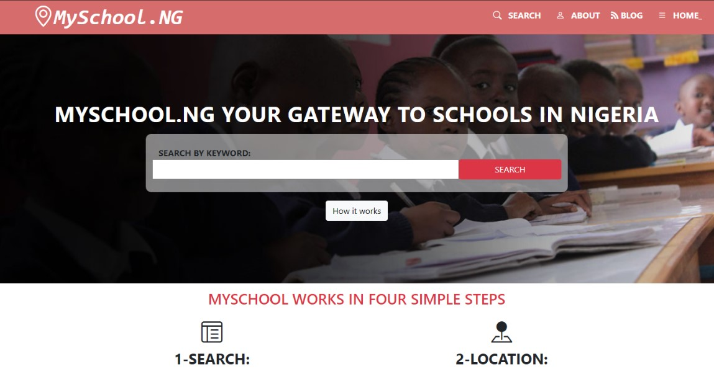
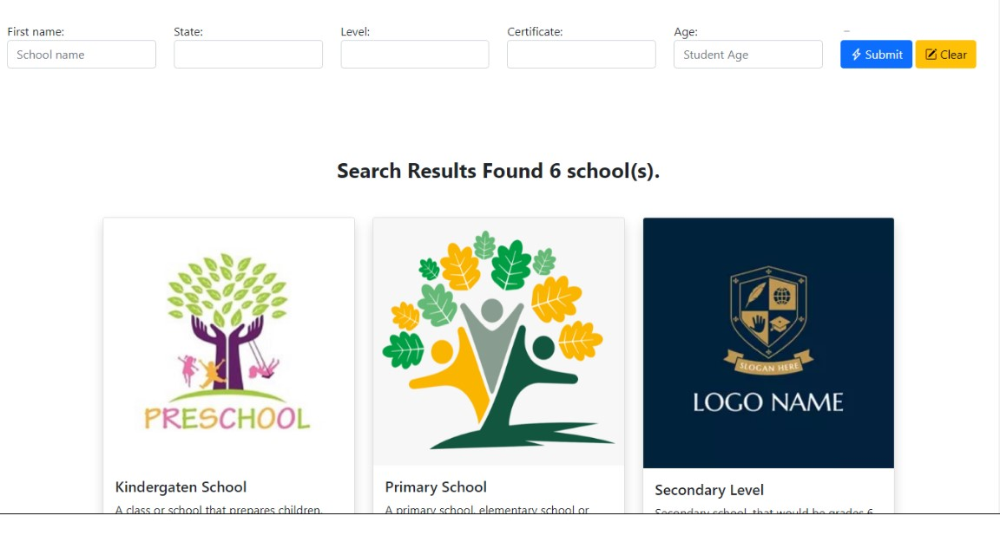
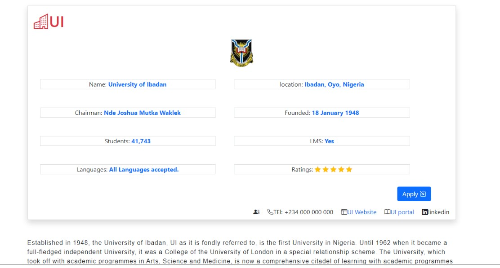

# MySchool.ng - A School Search Engine
# HTML & CSS capstone project (MySchool.ng - A School Search Engine)
A responsive website built following the original project specifications from [Capstone Project - Schools Search Engine](https://www.education.soiconsulting.com/topic/to-do-html-css-capstone-project/)

### Main page

### Search results page

### Details page

Project requirements included using semantic HTML tags, CSS selectors, HTML elements box model (margin, padding, width, height), Bootstrap, creating UIs adaptable to different screen sizes using mediaqueries and using industry-standard tools (flexbox) to place elements on the page.

The project was created using the [design](https://www.behance.net/gallery/25563385/PatashuleKE) of Matthew Njuguna & Sam Achola (Behance).

The project has 3 web pages - the main page, the search results page and the details page.

## Built With

- HTML5
- CSS3 Media Queries
- Bootstrap

## Live Demo

[Live Demo Link](https://yinktech.github.io/Schools_search/index.html)

## Author

* GitHub: [@YinkTech](https://github.com/YinkTech)
* Twitter: [@YinkTech](https://twitter.com/yinktech)
* Instagram: [@YinkTech](https://twitter.com/layinka4dat)
* LinkedIn: [Ayeni Olayinka](https://www.linkedin.com/in/ayeni-olayinka-726181134/)

## 🤝 Contributing

Contributions, issues, and feature requests are welcome!

Feel free to check the [issues page](https://yinktech.github.io/Schools_search/index.html).

## Show your support

Give a ⭐️ if you like this project!

## Acknowledgments

* Matthew Njuguna & Sam Achola (Design from [Behance](https://www.behance.net/gallery/25563385/PatashuleKE))

## 📝 License

This project is [MIT](https://github.com/git/git-scm.com/blob/master/MIT-LICENSE.txt) licensed.
